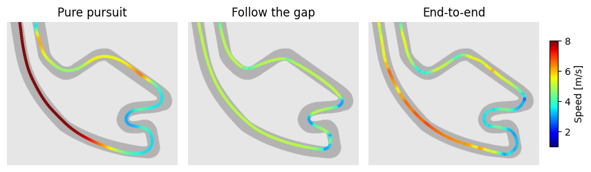
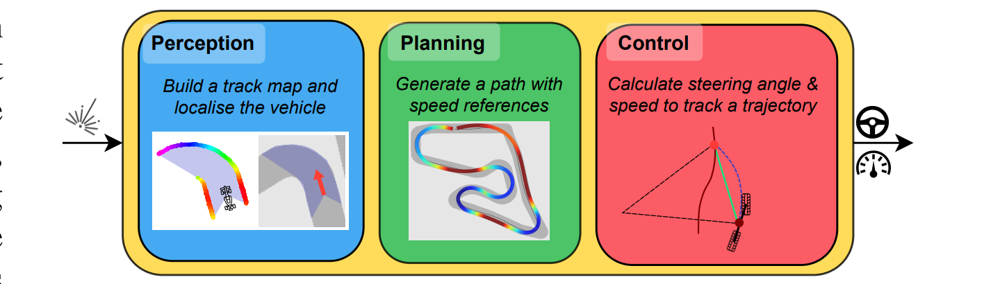
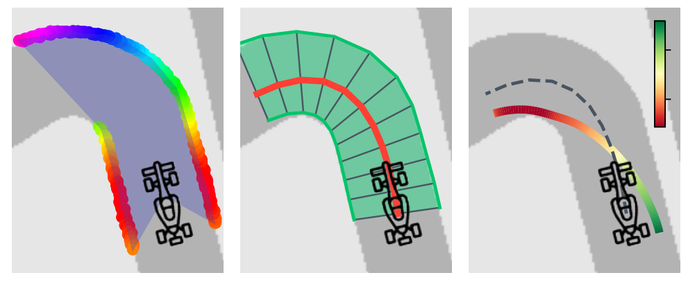

# F1Tenth Autonomous Racing Benchmarks


This repository contains code to run benchmark algorithms for F1Tenth autonomous racing. 
The follow methods are implemented.
1. [Classical racing:](#classic-racing) which uses a classic perception, planning and control stack with prior access to a map of the track.
2. [Mapless racing:](#mapless-racing) where the planner does not have any access to a map of the track and only the LiDAR scan and vehicle speed is available.
3. [End-to-end racing:](#end-to-end-learning-agents) training a deep reinforcement learning (DRL) agent to race.
4. [Local map racing:](#local-map-racing) at each timestep a local map is build that is used for planning.

Jump to [**Installation**](#usage)



## Overview

The repo separates algorithms in different subfolders for each category.

To run an algorithm, execute one of the Python scrips in the `run_scripts/` folder.
- The parameters for algorithm are in the relevant `.yaml` file in the `params/` directory
- There are functions to test the planner on one of the maps, or all the maps available.
- The files are maintained in such a way that they can be run and will generate results

## Algorithm description

### Classical racing

The classic racing stack has several key parts:
- **Particle filter localisation:** the particle filter that localises the vehicle uses state estimation theory to sample a proposal distribution and update it using the LiDAR data. More information is available [here](http://github.com/BDEvan5/sensor_fusion)
- **Optimal Trajectory Generation:** optimal trajectories (racelines) are generated using the `RaceTrackGenerator.py` script. The [trajectory_planning_helpers](https://github.com/FTM_TUM/trajectory_planning_helpers) library is used to generate minimum cuvature trajectories, followed by minimum time speed profiles.
- **Pure Pursuit Path Tracking:** the pure pursuit path tracker uses a geometric vehicle model to follow the optimal trajectory.
- **Model predictive contouring control:** the MPCC algorithm maximises progress along the center line (not requiring an optimal trajectory) using an receeding horizon optimisation approach.

**Note:** that you must generate an optimal raceline before you use the pure pursuit path tracking method.



### End-to-end learning agents

- The SAC and TD3 algorithms are used for end-to-end reinforcement learning which uses the last two LiDAR scans and vehicle speed as input to a neural network that directly outputs speed and steering angles. 
- The agents are trained using the [trajectory aided learning](https://ieeexplore.ieee.org/document/10182327) reward signal for 60,000 steps.


### Mapless Racing

**Follow the gap algorithm:** the follow the gap algorithm calculates the largest gap and then steers towards it.
- In the future, an artificial potential fields algorithm can be added here.

### Local Map Racing

- The local map racing method uses the LiDAR scan to extract a local map of the visible track region.
- The local map is then used for planning with either an MPCC or pure pursuit planner.



### Simulator
- The [f1tenth_gym](https://github.com/f1tenth/f1tenth_gym) base simulator is used, but repackaged to allow for the analytics to be collected. The dynamics model, and scan simulator model are kept the same to ensure that results are transferrable.

> The classical methods are tested with particle filter localisation and with the vehicle's true location. 
> This is done by providing two simulator classes; `F1TenthSim`, which only has the LiDAR scan and `F1TenthSim_TrueLocation` which includes the entire vehicle state.

### General notes

- The Notebooks folder contains `.ipynb` files that generate the results used in papers.
- The MPCC algorithm is still under development and not stable
- The `data_tools/` folder contains tools to manipulate and plot the result data\
- An important tool is the `build_results_df.py` script, which works through all the logs and builds a summary csv file with the data.


# Installation

## Recommended

It is recommended that you use a virtual environment to manage dependencies. A virtual environment can be created and sourced with the following commands:
```bash
python3.9 -m venv venv
source venv/bin/activate
```

The requirements and package can then be installed using,
```bash
pip install -r requirements.txt
pip install -e .
```

The [trajectory_planning_helpers](https://github.com/TUMFTM/trajectory_planning_helpers.git) library, must be installed independantly through the following commands, 
```
git submodule init
git submodule update
cd trajectory_planning_helpers
pip install -e .
```

The MPCC algorithms use the [casadi](https://web.casadi.org/python-api/) optimistion package, which relies on the IPOPT library. Instructions to install IPOPT can be found [here]().

## Docker (optional)

To ensure repeatability and useability, a Dockerfile is provided that can be used to run the code.

```
sudo docker build -t f1tenth_sim -f Dockerfile .                 # build the docker file
sudo docker compose up                                           # start the docker image
```

Enter the docker container using,
```
sudo docker exec -it f1tenth_sim-sim-1 /bin/bash
```
Doing this mounts the current folder as a volume. 
You can now run commands in the interactive shell.


